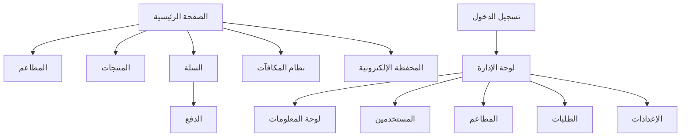

# ST🍕 Eat - نظام إدارة المطاعم وتوصيل الطعام


## 🌟 نظرة عامة على المشروع

**ST🍕 Eat** هو نظام متكامل لإدارة المطاعم وخدمات توصيل الطعام، مصمم بواجهة استخدام عربية متميزة. يربط النظام بين المطاعم والعملاء ومزودي خدمة التوصيل في منصة واحدة سهلة الاستخدام.

### 🔗 روابط المشروع

**URL المشروع**: [https://lovable.dev/projects/dcd4dfb3-541a-4b2b-bf77-2a48b51e85f3](https://lovable.dev/projects/dcd4dfb3-541a-4b2b-bf77-2a48b51e85f3)  
**النسخة المنشورة**: [https://st-eat.vercel.app](https://st-eat.vercel.app)

## 🏗️ هيكل المشروع

```
📂 ST-Eat
├── 📂 src                     # مصدر الكود الرئيسي
│   ├── 📂 components          # مكونات الواجهة الرئيسية
│   │   ├── 📂 admin           # مكونات لوحة الإدارة
│   │   │   ├── 📂 dashboard    # مكونات لوحة المعلومات
│   │   │   ├── 📂 orders       # إدارة الطلبات
│   │   │   ├── 📂 settings     # إعدادات النظام
│   │   ├── 📂 checkout        # مكونات عملية الدفع
│   │   ├── 📂 header          # مكونات رأس الصفحة
│   │   ├── 📂 products        # مكونات عرض المنتجات
│   │   ├── 📂 restaurant      # مكونات تسجيل المطاعم
│   │   ├── 📂 rewards         # مكونات نظام المكافآت
│   │   ├── 📂 team            # مكونات صفحة الفريق
│   │   ├── 📂 ui              # مكونات واجهة المستخدم العامة
│   │   └── 📂 wallet          # مكونات المحفظة الإلكترونية
│   ├── 📂 contexts            # سياقات التطبيق
│   ├── 📂 hooks               # الخطافات المخصصة
│   ├── 📂 integrations        # تكاملات مع خدمات خارجية
│   │   └── 📂 supabase        # تكامل مع Supabase
│   ├── 📂 lib                 # مكتبات مساعدة
│   ├── 📂 locales             # ملفات الترجمة (العربية والإنجليزية)
│   ├── 📂 mocks               # بيانات تجريبية
│   ├── 📂 pages               # صفحات التطبيق
│   ├── 📂 services            # خدمات التطبيق
│   └── 📂 types               # تعريفات الأنواع
├── 📂 public                  # الملفات العامة
│   └── 📂 lovable-uploads     # الصور المرفوعة
└── 📄 .env                    # متغيرات البيئة
```

## 🧠 خارطة المشروع



## ⚙️ لوحة الإدارة

تتميز لوحة الإدارة بواجهة عربية عصرية وسهلة الاستخدام، مصممة لتمكين مديري النظام من إدارة جميع جوانب التطبيق بكفاءة:

```
📊 لوحة الإدارة
│
├── 📈 لوحة المعلومات
│   ├── إحصائيات الطلبات والمبيعات
│   ├── رسوم بيانية للأداء
│   ├── قائمة أحدث الطلبات
│   └── تنبيهات النظام
│
├── 👥 إدارة المستخدمين
│   ├── العملاء
│   ├── أصحاب المطاعم
│   └── موظفي التوصيل
│
├── 🍽️ إدارة المطاعم
│   ├── طلبات التسجيل الجديدة
│   ├── قائمة المطاعم النشطة
│   └── تقييمات وتعليقات
│
├── 🛒 إدارة الطلبات
│   ├── جميع الطلبات
│   ├── طلبات جديدة
│   ├── طلبات قيد التحضير/التوصيل
│   ├── طلبات مكتملة
│   └── طلبات ملغاة
│
└── ⚙️ إعدادات النظام
    ├── إعدادات عامة
    ├── إعدادات الإشعارات
    ├── إعدادات الدفع
    └── إعدادات الأمان
```

## 🚀 كيفية تشغيل المشروع محليًا

1. **استنساخ المشروع**:
   ```bash
   git clone <رابط-المستودع>
   cd st-eat
   ```

2. **تثبيت الاعتمادات**:
   ```bash
   npm install
   ```

3. **إعداد متغيرات البيئة**:
   قم بنسخ ملف `.env.example` إلى `.env` وتعديل القيم حسب الحاجة:
   ```bash
   cp .env.example .env
   ```

4. **تشغيل وضع التطوير**:
   ```bash
   npm run dev
   ```

5. **فتح المتصفح**:
   افتح [http://localhost:8080](http://localhost:8080) لمشاهدة التطبيق.

## 🔑 بيانات تسجيل الدخول للإدارة

- **اسم المستخدم**: `admin`
- **كلمة المرور**: `admin123`

## 🛠️ التقنيات المستخدمة

- **الواجهة الأمامية**: React, TypeScript, Vite, Tailwind CSS
- **مكتبات UI**: shadcn/ui
- **إدارة الحالة**: React Context, React Query
- **الترجمة**: i18n (العربية والإنجليزية)
- **الرسوم البيانية**: Recharts
- **قاعدة البيانات**: Supabase

## 📱 ميزات التطبيق

- **تصميم متجاوب**: يعمل على جميع أحجام الشاشات
- **دعم ثنائي اللغة**: العربية والإنجليزية
- **الوضع الداكن/الفاتح**: تجربة مستخدم مخصصة
- **نظام مكافآت**: نقاط ومستويات للمستخدمين
- **محفظة إلكترونية**: لتسهيل المعاملات
- **تتبع الطلبات**: متابعة حالة الطلب في الوقت الحقيقي
- **لوحة إدارة**: لإدارة جميع جوانب النظام

## 📄 الترخيص

حقوق النشر © 2025 ST🍕 Eat
